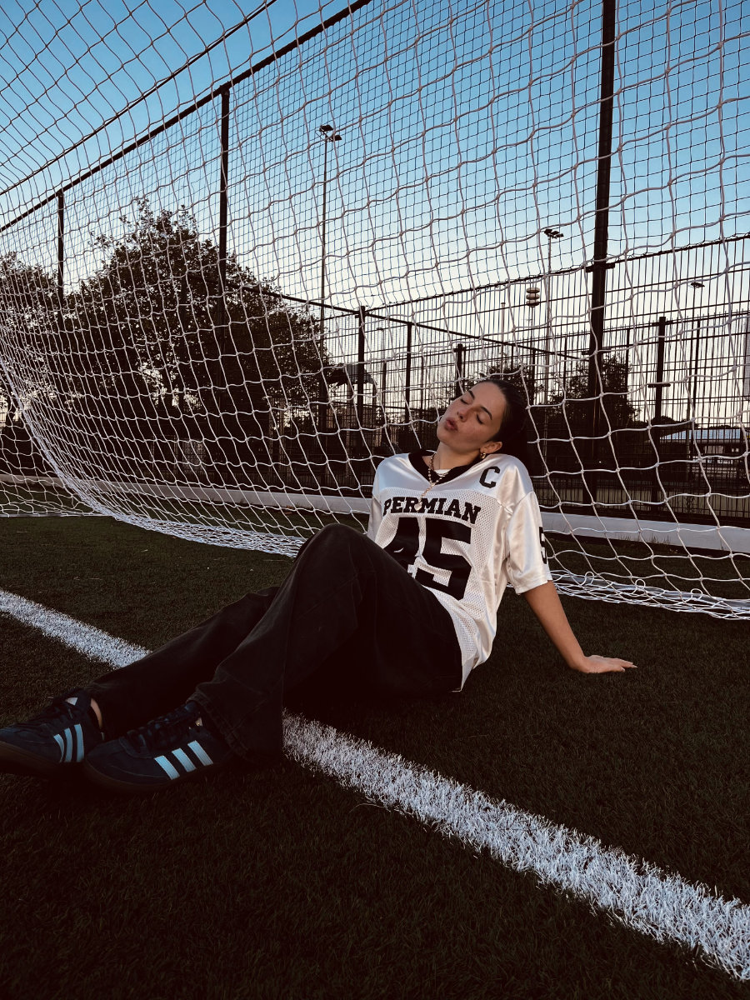

Let's move forward with the interviews with the other family members.  
I have already done both the one with Sophia and the one with Gemma, because I didn't want Gemma to be influenced by Sophia's answers. You will notice that some answers are quite similar, however. I will publish the interview with Gemma shortly, since I just need to create the post and it won't take me long.

Here is the interview.

---

_1) It was June 4th, almost 2 years ago, when you arrived in the Netherlands with your father. That summer you didn't yet know where you were going to live, you didn't understand Dutch yet, and everything was new. As of today, are you happy with the choice made to come and live here? Why?_

_Sophia:_ Yes, I am happy. Because I have changed a lot, from the point of view of my character, and I have had new experiences. I think if the me from two years ago saw how I am now, she would be satisfied and happy with my current life.

---

_2) What are the things you like most about the Netherlands?_

_Sophia:_ I like how much easier it is here to achieve your goals because you are given the tools to reach them faster.

On days when there is nice weather, I like how easy it is to go everywhere in the city by bike. I like Dutch cities; I think they are well-structured.

I also like the diversity of people living here because I have learned many things about different cultures, which opened my mind and helped me see the world differently.

---

_3) What are the things you like least about the Netherlands?_

_Sophia:_ The weather is absolutely terrible, and I didn't think it could have so much influence on my mood.

The Dutch _(to clarify, here Sophia is referring to people of Dutch origin and culture, and not immigrants or second generations)_ are very friendly, but they like to stay among themselves, they don't make efforts to integrate with other people, and they are not spontaneous at all.

Obviously the food, even if it feels a bit cliché to say it. It is absolutely terrible. Even the things that are considered specialties here, like those piece-of-shit croquettes… they make me want to throw up!

---

_4) A couple of months ago you went back to Tuscany for the first time, what was it like?_

_Sophia:_ For the first time, I saw the place where I grew up as if I were a tourist, because I was aware of having my life somewhere else. I knew it would just be a short visit, and it was strange.

It was nice to see all my friends and, seeing where they are now in their lives, it made me imagine what my life would have been like if I hadn't left. Even though I will never know exactly what life I would have had if I had stayed in Italy, I think this was the right choice.

It was a very strange feeling, while I was there, seeing all the places where I spent my childhood again and seeing people who have continued with their lives, as if those places had frozen in time.

---

_5) Do you think you will live in the Netherlands forever?_

_Sophia:_ Definitely not, I am quite convinced that I won't spend the rest of my life here, and I believe that anyway I won't live my whole life in just one place. I will finish all my studies here though, and I think the Netherlands is one of the best places in the world for students. So even if I won't stay here forever, I definitely see myself here for the next few years.

---

_6) Why do you think the Netherlands is a good place for students?_

_Sophia:_ First of all, the schools focus on very current programs and have a teaching style that is highly adapted to the needs of students; for example, in my school, many exercises given to you stimulate you to solve concrete problems.

From the lowest school levels, students establish a very different relationship with teachers compared to Italy, because they are continuously encouraged to express their opinions, even if they conflict with those of the teachers. We are constantly told how our ideas have value, and we feel comfortable having debates even with people of higher authority, always maintaining respect.

In general, the Netherlands is a young and friendly nation because it is very easy to find a job and change it frequently. There are many programs for students that allow you to find shared housing or alternative accommodations. Above all, the cities are very livable and perfect for students, full of life and initiatives, and young people are very involved in what happens in society, something I didn't feel in Italy. That's why I believe many young people leave Italy, because there it's hard to start anything from scratch.

---

_7) You recently started a new job, do you want to talk about it?_

_Sophia:_ Yes, I am working in an Italian restaurant here in Alphen aan den Rijn, which has a good reputation and has been open since the 1970s. I decided to work there because almost all the staff is Italian, and they are all very social and nice.

I really enjoy speaking Italian with other people, and I feel they understand me better than the people I go to school with, who are completely Dutch. The waitress job doesn't make me crazy, but being able to work with people who have more or less the same background as me is nice. I have many things in common with them; some came for studies or work, and I would have left Italy for studies anyway.

---

_8) A few days ago you received the news that you were accepted to the school here in Alphen, even if only for a final year before you go to university. What do you think about it?_

_Sophia:_ I am very pleased because I will no longer have to commute for an hour in the morning, but rather just an eight-minute bike ride.

The new school reminds me a bit of the ISK (the international transition school), and I like that because I find my current school, which is 100% Dutch, very monotonous. The building, both inside and out, is well-maintained, modern, and very large. In Italy, a building like that would only be a university. Inside, it's full of spaces where kids can study in groups and do many activities. I am curious to see how it goes.
