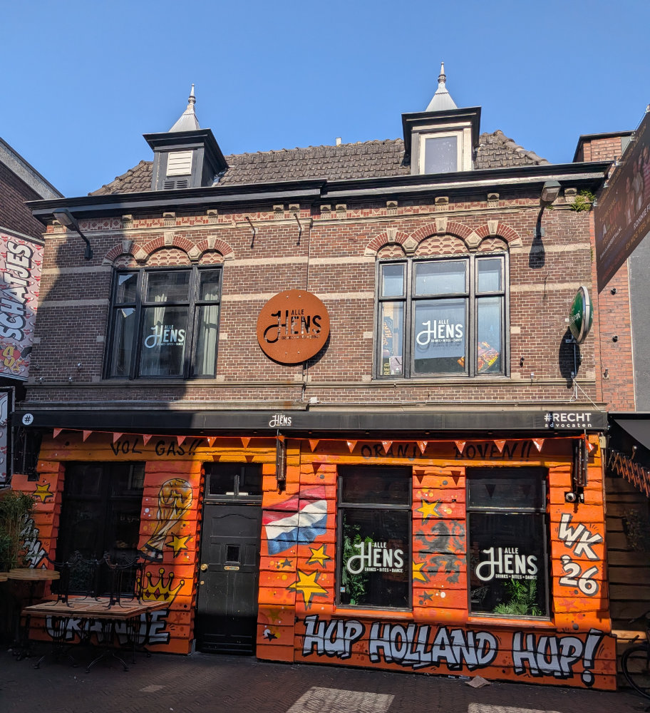
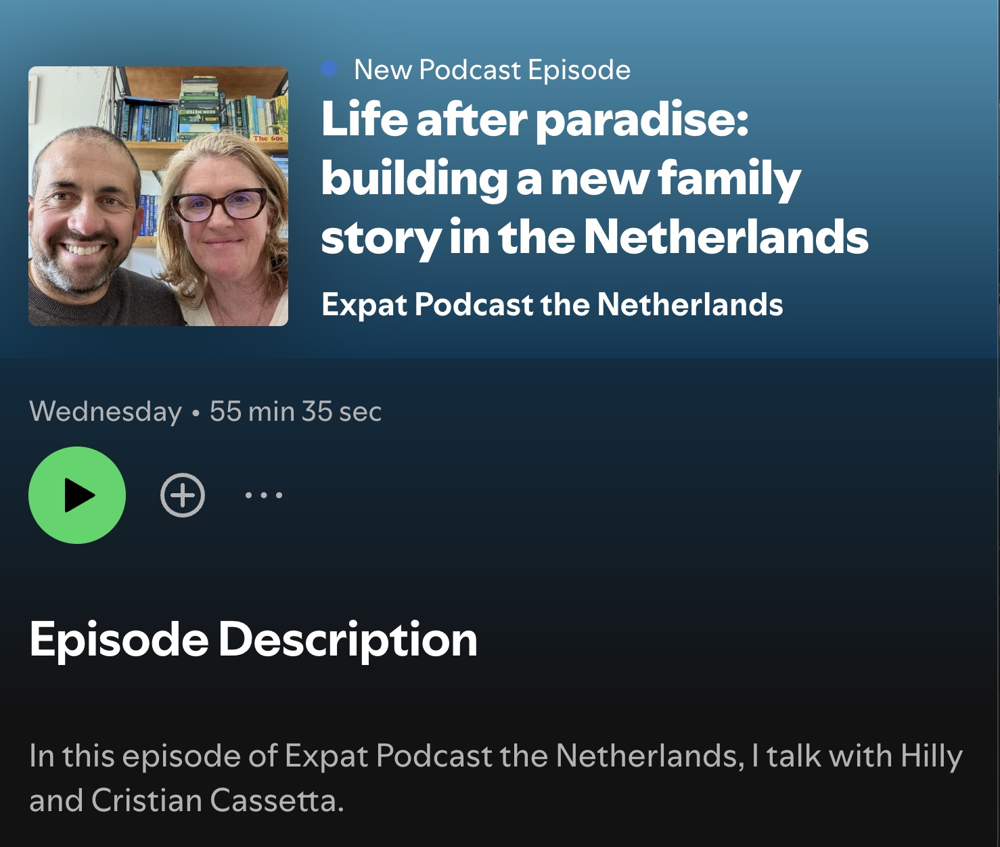
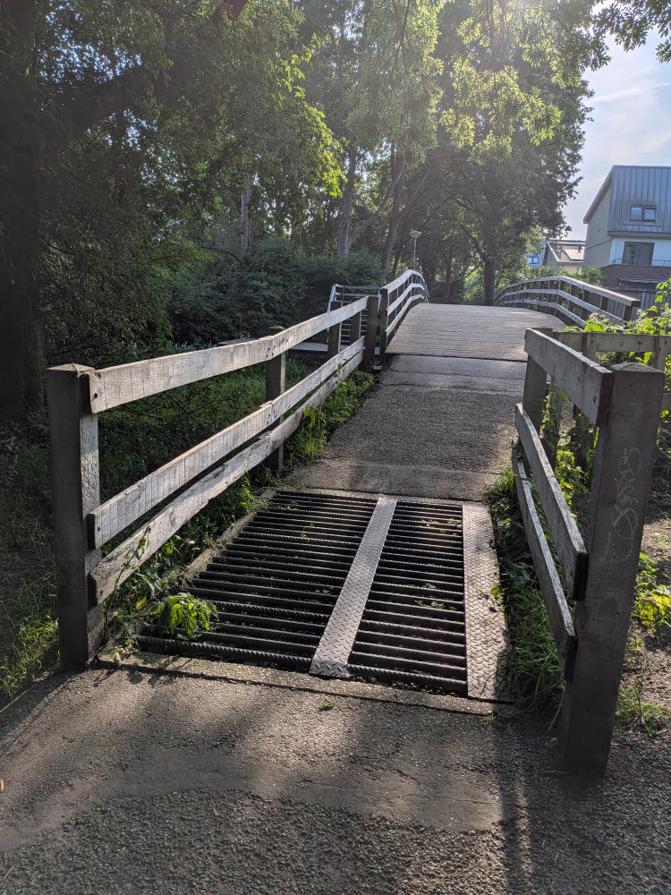
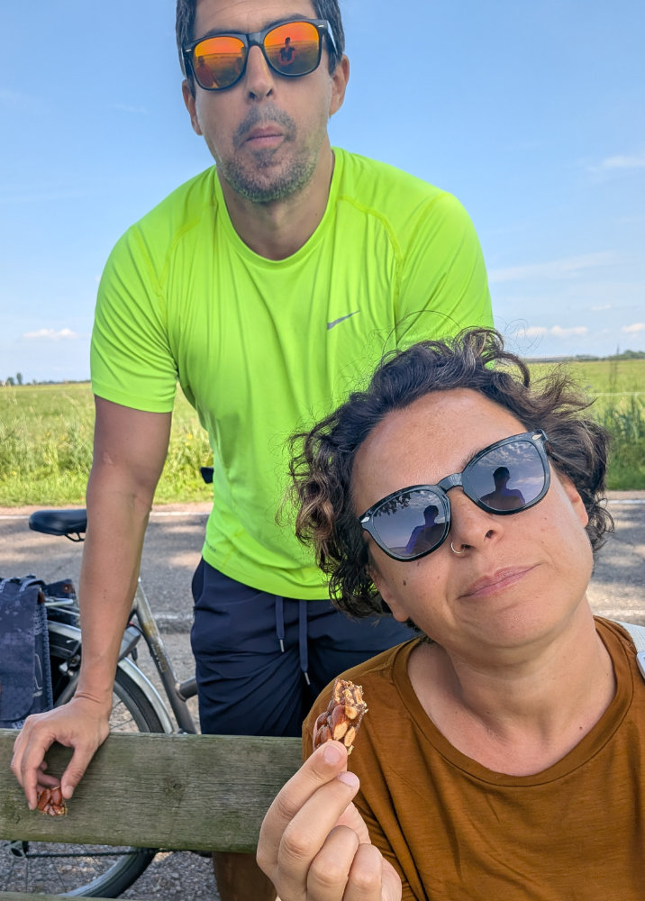
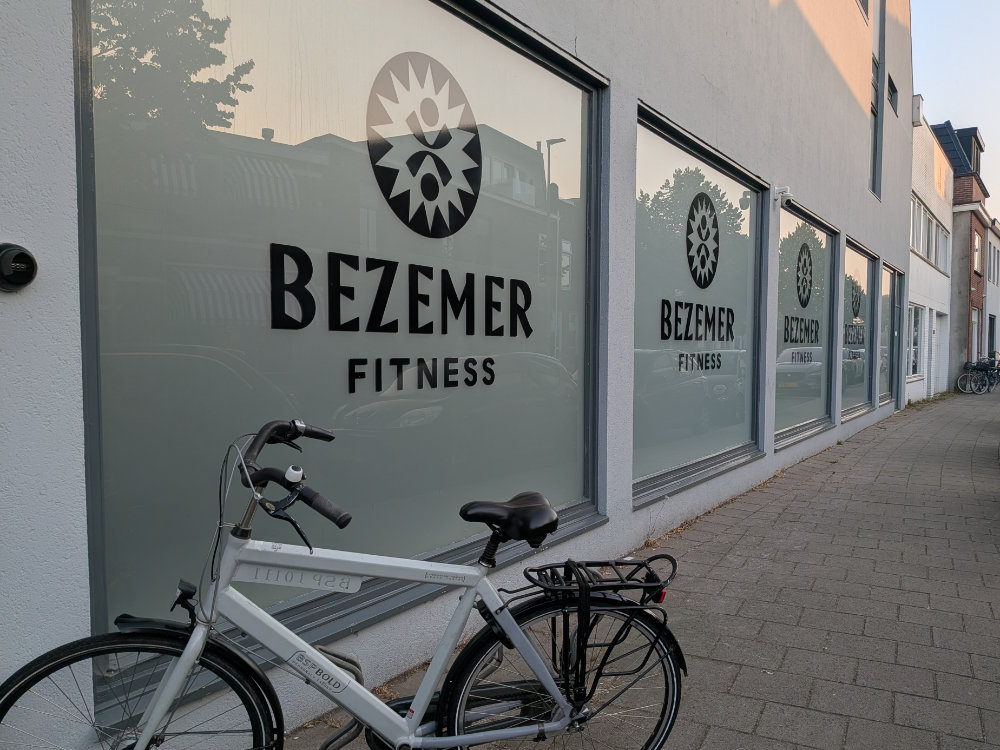
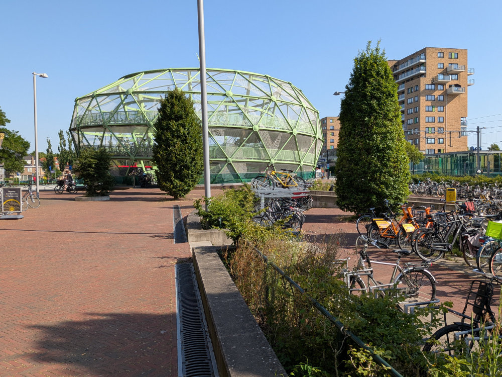
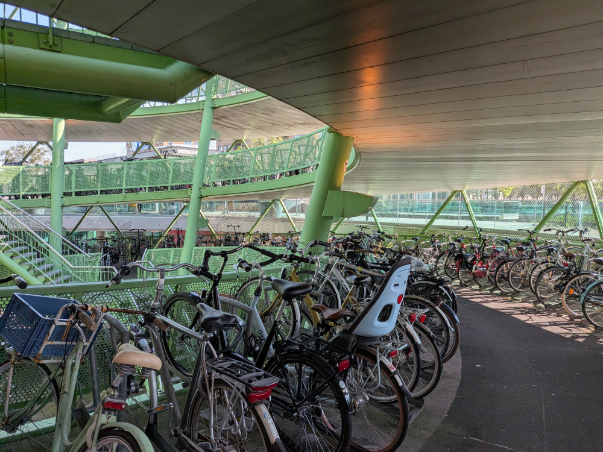
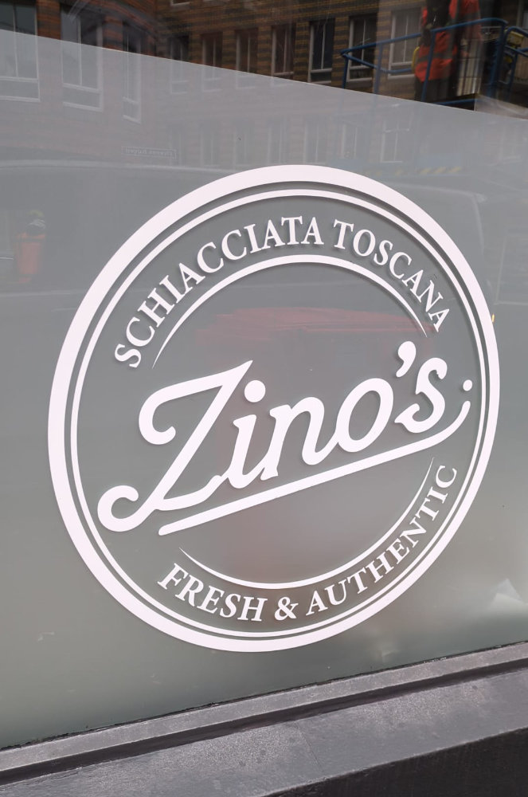

Before getting into a few updates, there's some news to share.

First of all, I want to introduce the improvements I've made to the blog. Maybe you've already noticed that you can now leave a comment under every post. You'll need to sign up first, and you can do that simply by using your email or by logging in with Google. Once you've signed up, I'll have to activate your account, and then you can write all the comments you like.\
I've also given the design a little refresh — changing it only slightly while tidying up the interface a bit.\
There's one more piece of news.\
When we decided to move to the Netherlands, about three years ago, I started looking into people who had made the same choice as us on social media, on YouTube, or by listening to podcasts. One of these podcasts is called "Expat Podcast the Netherlands" and in every episode they interview expats who moved to the Netherlands.\
The latest episode features Hilly and me and, if you'd like to listen to it, it's 55 minutes long and you can find it on the various platforms: Spotify, Apple Podcasts, Pocket Casts, and so on.\
At this link you'll find it on Spotify.

Now on to the updates.\
As happened with Leiden too, after the initial commotion of the move and the phase of adjusting to the new house and the new rhythms of life, things are settling down. The girls are reaching the end of the school year, which here in the Netherlands wraps up with the final exams, often decisive for being promoted to the next grade.\
On June 28th, tomorrow, Sophia turns 18, and to celebrate we gave her a five-day trip to Barcelona with one of her best friends from Italy, Anastasia. So for her, the final exam stress is greatly eased by the thought that, as soon as she's done with exams, she'll be off — as an eighteen-year-old — to the land of fun and games.\
Gemma is making a remarkable effort to catch up on a few subjects essential to her promotion; for her, exams start on June 29th and will last a week. She's had some excellent results lately, but it's not over yet.

Hilly has signed a new work contract, still in the same place, but about a month ago her hours changed. At last she too has every weekend free, which is no small thing. She's always on the lookout for a more fulfilling job, but for now what's on the horizon is the holiday in South Africa for the whole month of August, and she can't wait — like all of us, but maybe her a little more.

Alphen aan den Rijn has transformed quite a bit in the summer.\
The hideous avenues full of cars are now made more pleasant by the lush greenery of the big trees that shade them. The park behind our house is full of plants, flowers, and scents. The cows graze freely all over the park, which they can't leave because of the cattle grids. For anyone who doesn't know what cattle grids are — since in Italy especially they aren't used much — they're also called "cattle guards," metal structures made of parallel bars laid over a pit dug into the ground.

In early June, Matteo and Brunella came to visit us from Milan, and with them we explored the area around Alphen aan den Rijn by bike, racking up dozens of kilometers.
Our house is on the far north-east edge of Alphen, and from there it's easy to head into the "Groene Hart," in English the "Green Heart," a wide area made up entirely of fields, canals, lakes, woods, and little villages. You can pedal all day surrounded by nature.
Little by little, partly out of necessity, partly because things reveal themselves a bit at a time, Alphen is finding its way into my heart.

Around Alphen you see plenty of houses decked out in orange and with the symbols of the Dutch national football team. And the flags are everywhere. The Dutch are as football-mad as the Italians, and they love gathering in groups to watch the World Cup matches in which the Netherlands plays. Two years ago we watched a few of the Euros matches, when we were in Zwolle doing pet-sitting. We're watching a lot of matches and we're rooting for the Netherlands a bit too, but mainly for South Africa, and then a bit for Spain, Brazil, Egypt, and Saudi Arabia. The last two for sentimental reasons of Gemma's and Sophia's.

In the morning, before going to work, I've started stopping by the gym for an hour of training. The gym isn't far from Alphen station. Once I've worked up a sweat, I take a nice shower, have a coffee, and then hop back on the bike to go park at the station, in the huge bike-parking apple, where I catch the train to work.
I've been following this routine for a month and a half now, five days a week, and I feel much better. Any kind of back pain is just a bad memory; let's hope it stays that way.

My job is going well.
Every day there's some problem to solve between one chat and another with colleagues or guests. When I move from one hotel to the next, I make my way through the hordes of tourists and locals. Den Haag is full of life this time of year, but it's a pleasant, energizing chaos. Within about fifty meters of the hotel there are some Italian fast-food spots. One of them makes stuffed Tuscan schiacciata. They look good, but I haven't tried them yet. A schiacciata with ham and cheese costs 17 euros.
For lunch I always eat the leftovers from the guests' breakfast that would otherwise be thrown away.
Little baked sausages, cooked ham, brie, smoked salmon, hard-boiled eggs, orange juice, fruit.\
All for free!\
If one day I become a millionaire, then Tuscan schiacciata every day.

