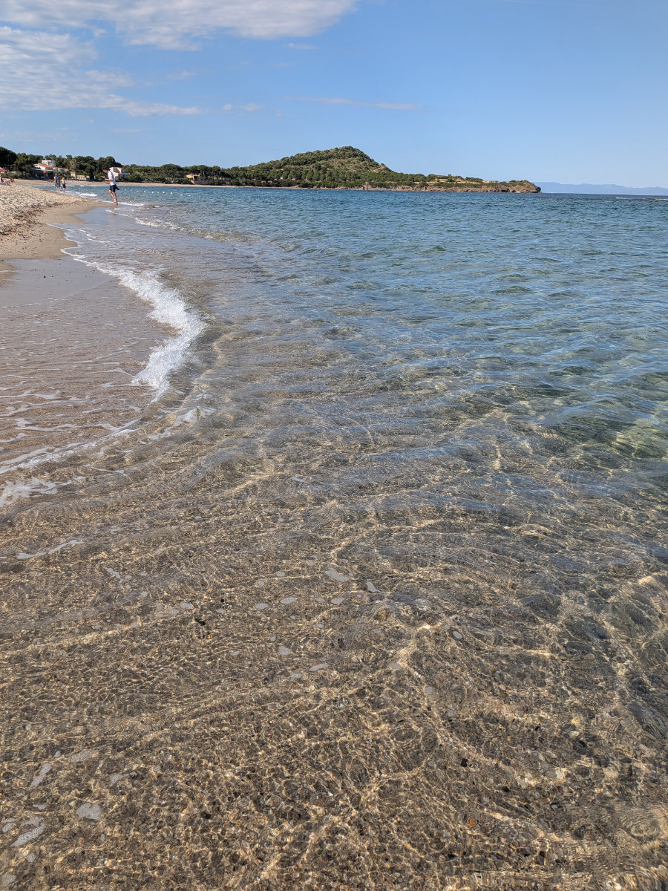
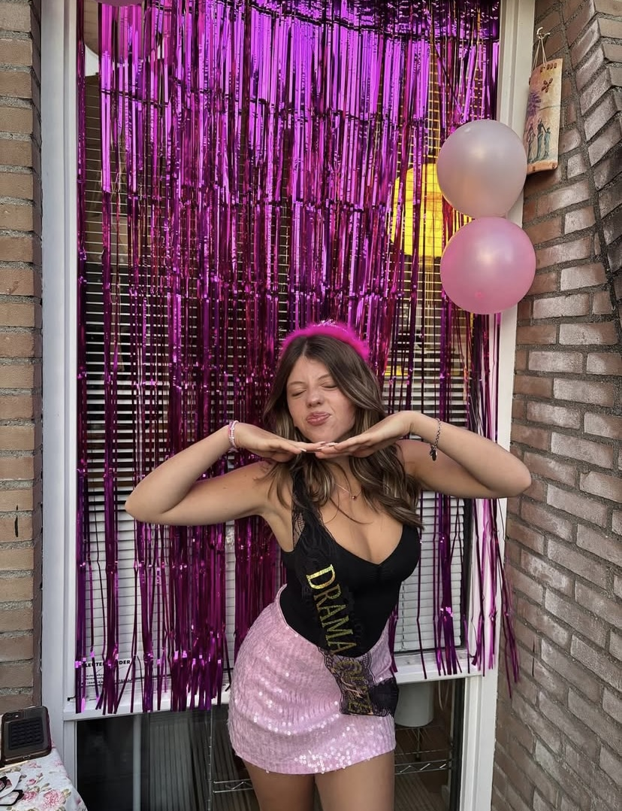

Ieri sono tornato dalla Sardegna, sono stato li per 3 giorni e mezzo per trovare i miei genitori e mia sorella Annalisa e la sua famiglia. I miei non li vedevo da natale ma mia sorella e la famiglia erano già due anni e mezzo.\
E' stato bellissimo.\
Questo è il periodo migliore dell'anno per andare in Sardegna, ci sono ancora pochi turisti, le giornate sono lunghe e calde, ma non troppo.
Ho fatto un bagno a Chia, una zona che porto nel cuore perche' ci ho passato un sacco di estati memorabili. Da bambino facevamo campeggio libero sulle dune di sabbia, quanti ricordi.\
Fare il bagno in quel mare limpido e' stato incredibilmente rigenerante.

Ma ora veniamo all'intervista a Gemma.

---

_1) Fra poco saranno due anni che sei andata a vivere in Olanda. Quando sei arrivata non sapevi ancora dove saresti andata a vivere, non capivi ancora l'Olandese e tutto era nuovo. Ad oggi, sei felice della scelta fatta di venire a stare qui?_

_Gemma:_ Per alcuni aspetti si, per altri no.

---

_2) Cosa ti piace della vita in Olanda?_

_Gemma:_ Prima di tutto il fatto che ora viviamo in città. E' stato bello crescere in campagna però una volta diventata adolescente e' più bello essere in città per essere indipendenti.

Mi piace anche il fatto che siamo esposte a molte culture, anche il fatto che noi prima vivevamo in un paesino, tutto protetto, mentre ora siamo piu' esposte alla vita reale.

Un'altra cosa che mi piace dell'Olanda e che la donna qui viene valorizzata di piu', anche nel posto di lavoro e non c'e' tanto patriarcato come in italia. Questo si vede gia' ad una giovane età, nelle scuole. Le ragazze non si fanno sottomettere e sanno far valere le proprie opinioni, questo lo vedono dalle proprie madri. La figura della donna indipendente e' la norma.

Un'altra altra cosa che mi piace e' l'organizzazione, nelle scuole, nei trasporti pubblici, negli eventi. Nelle scuole i ragazzi vengono valorizzati molto e non sottomessi dai professori.

---

_3) Cosa non ti piace dell'Olanda._

_Gemma:_ La lingua suona proprio male. Non che sia difficile, dopotutto, ma la lingua in sé non e' bella, non suona bene. Il cibo e anche il fatto che sia difficile trovare buoni ingredienti nei supermercati. Il meteo e le temperature che influenzano molto anche l'umore.

Alcuni aspetti della mentalita' olandese. E' bello che la gente sia diretta pero' a volte lo fanno in un modo che a me sembra maleducato.

Gli adolescenti hanno poco rispetto per le persone intorno a loro e per i luoghi pubblici.

---

_4) Un paio di mesi fa sei tornata in Toscana, per la prima volta, com'è stato?_

_Gemma:_ E' stato strano ma familiare. Assurdo come li la vita sia andata avanti, il tempo e' passato ma tutto mi e' sembrato uguale a prima che me ne andassi. Mi sento comunque sempre piu' a casa in Toscana, che qui.

---

_5) Tu infatti non volevi trasferirti in Olanda. Avresti preferito rimanere a Montaione?_

_Gemma:_ In quel momento si, l'avrei preferito, pero' ora non piu'. Mi manca ma so che qui ho molta più libertà e ho imparato molte cose che mi servivano.

---

_6) Non credi che le avresti imparate anche in Italia._

_Gemma:_ No perche' e' proprio l'ambiente a cui sono stata esposta che mi ha insegnato queste cose. Ad esempio le persone dell'ISK (scuola internazionale di transizione), di cui la maggior parte venivano da culture ed esperienze, anche traumatiche, diverse.

L'Olanda e' molto liberale e la maggior parte della gente ha una mentalita' avanzata e aperta.

Ho anche visto in giro delle cose che in un paesino come Montaione non avrei mai vissuto.

Da un momento all'altro sia io che Sophia ci siamo ritrovate ad avere una libertà enorme. Siamo passate dal dover essere portate ovunque in auto e uscire e andare a scuola nello stesso paesino, dove tutti si conoscono, ad essere in una città multiculturale, dove prendiamo la bici, o il pullman e possiamo andare dovunque.

---

_7) Pensi che vivrai in Olanda per sempre._

_Gemma:_ No, per niente. Se devo pensare a me stessa, no, ma se dovessi pensare ad avere figli qui, non sarebbe così male alla fine. L'Olanda e' un bel posto dove avere una famiglia e avere dei bambini. Puoi permettergli di vivere in un ambiente abbastanza protetto, non e' cosi pericolosa l'Olanda, ma allo stesso tempo possono essere esposti ad altre culture e si responsabilizzano molto in fretta secondo me.

---

_8) Come ti trovi a scuola e quali pensi siano le differenze con la scuola italiana._

_Gemma:_ Sicuramente qui gli alunni hanno la propria responsabilita', non viene fatto nulla attraverso i genitori. L'ambiente e' molto paritario tra alunno e professore e credo meno stressante della scuola italiana.

---

_8) Hai intenzione di trovarti un lavoro?_

_Gemma:_ Appena faccio sedici anni voglio andare a lavorare dove lavora Sophia. L'ha già detto ai responsabili del ristorante e hanno detto di si. Non vorrei lavorare nei supermercati, come fanno molti già dai quattordici anni, perché ho visto quanto sia disorganizzato quando lavorai in un supermercato per qualche mese.

---

_9) Ti piace la nuova casa o preferivi quella di prima._

_Gemma:_ La casa in se e' meglio questa perché ho una camera enorme e la casa e molto piu' grande. Però, come location, preferivo quella di prima.
